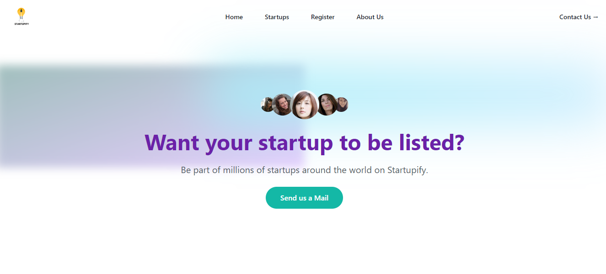

# Startupify

**Startupify** is a platform designed to help new startups grow their businesses by providing a space for them to register, set their funding goals, and allow interested users to contribute toward their success. Whether you're launching a startup or looking to support one, Startupify makes it easy to connect and raise funds.



## Features

- Startups can register and set a funding goal.
- Users can explore and browse listed startups.
- Individuals can contribute funds to help startups reach their financial goals.
- Responsive, clean UI built with **Tailwind CSS** for a great user experience.

## Tech Stack

- **Backend**: Node.js, Express.js, MongoDB
- **Frontend**: React.js, React Router DOM
- **Styling**: Tailwind CSS
- **State Management**: React Hooks
- **Other Libraries**: Various popular npm libraries for utility tasks

## Getting Started

### Prerequisites

Ensure you have the following installed on your local machine:

- [Node.js](https://nodejs.org/) (v14+)
- [MongoDB](https://www.mongodb.com/) (Local or MongoDB Atlas)
- [npm](https://www.npmjs.com/) or [yarn](https://yarnpkg.com/)

### Installation

1. **Clone the repository:**

    ```bash
    git clone https://github.com/imadityaxd/startup0.git
    ```

2. **Navigate into the project directory:**

    ```bash
    cd startup0
    ```

3. **Install the dependencies for both frontend and backend:**

    **For the backend:**

    ```bash
    cd server
    npm install
    ```

    **For the frontend:**

    ```bash
    cd frontend
    npm install
    ```

4. **Configure environment variables:**

    Create a `.env` file in the `backend` folder with the following environment variables:

    ```bash
    MONGODB_URI=<your-mongodb-connection-string>
    PORT=<your-port>
    ```

5. **Run the backend server:**

    ```bash
    cd backend
    npm start
    ```

6. **Run the frontend development server:**

    In a separate terminal window:

    ```bash
    cd frontend
    npm start
    ```

7. **Access the application:**

    - Frontend: [http://localhost:5173](http://localhost:5173)
    - Backend API: [http://localhost:3000](http://localhost:3000)

## Project Structure

```plaintext
startupify/
├── backend/                   # Backend (Node.js, Express) code
│   ├── controllers/           # API request handlers
│   ├── models/                # MongoDB models
│   ├── routes/                # Express routes
│   └── server.js              # Backend entry point
├── frontend/                  # Frontend (React) code
│   ├── src/                   # Main React app files
│   │   ├── components/        # Reusable components
│   │   ├── pages/             # Page components (Home, Payment, etc.)
│   │   └── App.js             # Main app entry point
│   └── public/                # Static files (e.g., images)
├── .env                       # Environment variables
├── README.md                  # Project documentation
└── package.json               # Dependencies and scripts
```

### API Endpoints
- Backend API Routes
```bash
GET /api/startups - Fetch all startups
POST /api/startups - Register a new startup
POST /api/payment - Process a payment for a specific startup
Frontend Routes
/ - Home page showing the list of startups
/payment - Page to contribute to a selected startup
```

### Usage

- For Startups: Register your startup on the platform and set your funding goal.
- For Donors: Browse startups and contribute to the ones you're passionate about.
Contributing
- If you'd like to contribute to this project, feel free to fork the repository and submit a pull request, or report issues in the issue tracker.**

### License
- This project is licensed under the MIT License.
